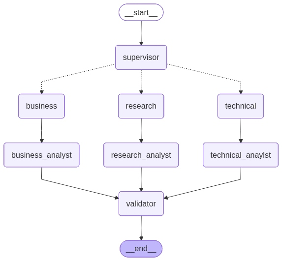

# LangGraph Multi-Agent Chat System

A production-ready, full-stack AI application built with **LangGraph**, **FastAPI**, and **Next.js**.  
The system orchestrates specialized **business**, **research**, and **technical** agents with:

- Multi-step reasoning and routing
- Web search–augmented synthesis
- Conversation memory using a checkpointer
- Streaming and non-streaming responses
- Clean, modular architecture suitable for real-world projects

---

## Features

- **Multi-Agent Architecture**
  - Supervisor agent routes questions to **business**, **research**, or **technical** specialists.
  - Synthesis agents combine LLM output with web search for more reliable answers.
  - Validator agent scores answer quality (0–10) before returning to the user.

- **Memory & Threading**
  - Conversation-level memory using LangGraph checkpointer.
  - `thread_id` support to maintain separate chat sessions.
  - Ability to retrieve state and history per thread.

- **Full-Stack Implementation**
  - **Backend**: FastAPI + LangGraph + Groq LLM + Tavily search.
  - **Frontend**: Next.js (App Router), TypeScript, Tailwind CSS.
  - Streaming via Server-Sent Events (SSE) for incremental UI updates.

- **Production-Ready Design**
  - Clear separation of concerns (agents, synthesis, validators, routers, graph, config).
  - Environment-based configuration.
  - CORS, logging, and basic security headers.
  - `.gitignore` tuned for Python + Node.js monorepo.

---

## Architecture & Workflow

The system implements a **multi-agent orchestration pattern** with intelligent routing and synthesis capabilities.

<p align="center">
  
</p>

### Workflow Steps

1. **Start** → User submits a question via the Next.js frontend
2. **Supervisor Agent** → Analyzes and classifies the question as:
   - 🏢 **Business** (strategy, finance, marketing, management)
   - 🔬 **Research** (academic, scientific, theoretical)
   - 💻 **Technical** (programming, engineering, system design)
3. **Domain Agent** → Specialized agent generates initial response
4. **Synthesis Agent** → Enhances answer by merging:
   - LLM-generated insights (Groq - Llama 3.3 70B)
   - Real-time web search results (Tavily)
5. **Validator Agent** → Quality assurance and confidence scoring (0-10)
6. **End** → Returns structured response with answer, classification, and confidence

### Agent Responsibilities

| Agent | Domain | Example Questions |
|-------|--------|------------------|
| 🏢 **Business Agent** | Strategy, Finance, Operations, Marketing | "What is SWOT analysis?", "How to conduct market research?", "Explain startup funding" |
| 🔬 **Research Agent** | Academic, Scientific, Theoretical | "Explain quantum computing", "What is the scientific method?", "Climate change research" |
| 💻 **Technical Agent** | Programming, Engineering, System Design | "Write a Python sorting algorithm", "Explain REST APIs", "Design a microservice" |

---

## Tech Stack

### Backend

- **Language**: Python 3.10+
- **Framework**: FastAPI
- **Orchestration**: LangGraph
- **LLM Provider**: Groq (e.g., `llama-3.3-70b-versatile`)
- **Search**: Tavily
- **HTTP Server**: Uvicorn

### Frontend

- **Framework**: Next.js 15+ (App Router, TypeScript)
- **UI**: React 18, Tailwind CSS
- **HTTP Client**: Axios + Fetch (for SSE)
- **Icons & UI Enhancements**: `lucide-react`, `react-markdown`

---

## Project Structure

```
Langgraph-Project/
├── backend/
│   ├── api/
│   │   ├── routes/
│   │   │   └── agent.py        # FastAPI endpoints (ask, stream, history, state, status)
│   │   └── middleware.py       # Logging, CORS, security headers
│   ├── config/
│   │   ├── settings.py         # Environment & configuration management
│   │   └── prompts.py          # System prompts (supervisor, agents, synthesis, validator)
│   ├── src/
│   │   ├── agents/             # Business, research, technical agents
│   │   │   ├── base_agent.py   # Base agent class
│   │   │   ├── business_agent.py
│   │   │   ├── research_agent.py
│   │   │   └── technical_agent.py
│   │   ├── synthesis/          # Synthesis agents & base class
│   │   │   ├── base_synthesis.py
│   │   │   └── synthesis_agents.py
│   │   ├── validators/         # Validator agent for quality assurance
│   │   │   └── validator.py
│   │   ├── routers/            # Supervisor & routing logic
│   │   │   └── supervisor.py
│   │   ├── utils/              # State, schemas, tools (Tavily search)
│   │   │   ├── state.py        # LangGraph state definition
│   │   │   ├── schemas.py      # Pydantic models
│   │   │   └── tools.py        # External API integrations
│   │   └── graph/
│   │       └── workflow.py     # LangGraph StateGraph construction & memory
│   ├── .env                    # Backend environment (not committed)
│   ├── requirements.txt        # Python dependencies
│   └── main.py                 # FastAPI entrypoint
├── frontend/
│   ├── src/
│   │   ├── app/
│   │   │   ├── page.tsx        # Main chat interface page
│   │   │   ├── layout.tsx      # Root layout with metadata
│   │   │   └── globals.css     # Global styles & Tailwind
│   │   ├── components/
│   │   │   ├── ChatInterface.tsx   # Main chat component
│   │   │   ├── MessageList.tsx     # Message rendering with markdown
│   │   │   └── InputForm.tsx       # User input form (if separated)
│   │   ├── services/
│   │   │   └── api.ts          # API client (ask, stream, history, state)
│   │   └── types/
│   │       └── index.ts        # Shared TypeScript interfaces
│   ├── public/                 # Static assets
│   ├── package.json            # Node.js dependencies
│   ├── tsconfig.json           # TypeScript configuration
│   ├── tailwind.config.js      # Tailwind CSS configuration
│   ├── postcss.config.js       # PostCSS configuration
│   ├── next.config.js          # Next.js configuration
│   └── .env.local              # Frontend environment (not committed)
├── workflow-diagram.png        # Architecture visualization
├── .gitignore                  # Git ignore rules
├── LICENSE                     # MIT License
└── README.md                   # This file
```

---

## Prerequisites

- **Python** 3.10+
- **Node.js** 18+
- **Git**
- API keys for:
  - [**Groq**](https://console.groq.com/) (LLM)
  - [**Tavily**](https://tavily.com/) (Web search)

---

## Backend Setup (FastAPI + LangGraph)

### 1. Navigate to backend

```
cd backend
```

### 2. Create & activate virtual environment

```
# Windows (PowerShell)
python -m venv .venv
.\.venv\Scripts\Activate

# Linux / macOS
python -m venv .venv
source .venv/bin/activate
```

### 3. Install dependencies

```
pip install -r requirements.txt
```

### 4. Configure environment variables

Create `.env` in `backend/`:

```
GROQ_API_KEY=your_groq_api_key_here
TAVILY_API_KEY=your_tavily_api_key_here
```

### 5. Run backend server

```
python main.py
```

**Backend will be available at:**

- 🌐 API Root: `http://localhost:8000/`
- ✅ Health Check: `http://localhost:8000/health`
- 🤖 Agent Endpoint: `POST http://localhost:8000/api/v1/ask`
- 📚 API Docs: `http://localhost:8000/docs` (Swagger UI)

---

## Frontend Setup (Next.js)

### 1. Navigate to frontend

```
cd frontend
```

### 2. Install dependencies

```
npm install
# or
yarn install
```

### 3. Configure frontend environment

Create `.env.local` in `frontend/`:

```
NEXT_PUBLIC_API_URL=http://localhost:8000
```

### 4. Run Next.js dev server

```
npm run dev
# or
yarn dev
```

**Frontend will be available at:**

- 🖥️ Application: `http://localhost:3000/`

---

## How It Works

### Request Flow

1. **User Input** → User enters a question in the Next.js chat interface
2. **API Call** → Frontend sends `POST /api/v1/ask` (or `/ask/stream` for streaming)
3. **Workflow Execution** → FastAPI passes question + `thread_id` to LangGraph `AgentWorkflow`
4. **Agent Pipeline**:
   - **SupervisorAgent** → Classifies question (business / research / technical)
   - **Domain Agent** → Generates specialized response based on classification
   - **Synthesis Agent** → Merges LLM output with Tavily web search results
   - **ValidatorAgent** → Scores answer quality and confidence (0–10)
5. **Response** → Structured JSON returned with answer, classification, reasoning, and confidence
6. **UI Update** → Frontend displays formatted response with metadata badges

### Memory & Conversation Threading

- Each conversation maintains context using a unique `thread_id` (stored in browser session storage)
- **LangGraph MemorySaver** checkpointer persists state across multiple turns
- **Conversation History**: Access via `GET /api/v1/history/{thread_id}`
- **State Inspection**: Debug current state via `GET /api/v1/state/{thread_id}`

---

## API Endpoints

### `POST /api/v1/ask`

Submit a question (non-streaming mode).

**Request:**

```
{
  "question": "What is SWOT analysis, and how is it used in strategic planning?",
  "thread_id": "thread-123-abc",
  "stream": false
}
```

**Response:**

```
{
  "question": "What is SWOT analysis, and how is it used in strategic planning?",
  "answer": "SWOT analysis is a strategic planning framework used to evaluate...",
  "confidence_score": "9",
  "classifier": "business",
  "reasoning": "The question relates to business strategy and management frameworks.",
  "timestamp": "2025-12-25T12:00:00Z",
  "thread_id": "thread-123-abc"
}
```

### `POST /api/v1/ask/stream`

Submit a question with **Server-Sent Events (SSE)** streaming.

Returns incremental updates as the workflow progresses through each agent node.

### `GET /api/v1/history/{thread_id}`

Retrieve conversation history for a specific thread.

**Response:**

```
{
  "thread_id": "thread-123-abc",
  "messages": [
    {
      "question": "What is SWOT analysis?",
      "answer": "...",
      "classifier": "business",
      "confidence": "9"
    }
  ],
  "total_interactions": 5
}
```

### `GET /api/v1/state/{thread_id}`

Get current LangGraph state snapshot for debugging.

### `GET /api/v1/status`

Service health and metadata.

**Response:**

```
{
  "status": "operational",
  "model": "llama-3.3-70b-versatile",
  "available_agents": ["business", "research", "technical"],
  "features": {
    "streaming": true,
    "synthesis": true,
    "validation": true,
    "memory": true,
    "checkpointer": "MemorySaver"
  }
}
```

---

## Development Workflow

### Backend Development

- **Modify Prompts**: Edit `backend/config/prompts.py` to tune agent behavior
- **Add New Agents**: Extend `backend/src/agents/` with new specialized agents
- **Adjust Routing**: Update `backend/src/routers/supervisor.py` for classification logic
- **Graph Configuration**: Modify `backend/src/graph/workflow.py` for workflow changes

### Frontend Development

- **UI Components**: Edit `frontend/src/components/` for interface changes
- **API Integration**: Update `frontend/src/services/api.ts` for new endpoints
- **Styling**: Customize `frontend/src/app/globals.css` and `tailwind.config.js`
- **Types**: Maintain `frontend/src/types/index.ts` for type safety

---

## Testing

### Backend Tests

```
cd backend
pytest tests/
# or
python -m pytest tests/ -v
```

### Frontend Tests

```
cd frontend
npm run test
# or
yarn test
```

Create test files in:
- Backend: `backend/tests/`
- Frontend: `frontend/__tests__/` or `frontend/src/__tests__/`

---

## Deployment

### Backend Deployment

**Option 1: Docker**

```
# Dockerfile (backend)
FROM python:3.11-slim
WORKDIR /app
COPY requirements.txt .
RUN pip install --no-cache-dir -r requirements.txt
COPY . .
CMD ["uvicorn", "main:app", "--host", "0.0.0.0", "--port", "8000"]
```

**Option 2: Traditional Server**

```
# Install dependencies
pip install -r requirements.txt

# Run with production server
gunicorn main:app -w 4 -k uvicorn.workers.UvicornWorker --bind 0.0.0.0:8000
```

### Frontend Deployment

**Option 1: Vercel** (Recommended for Next.js)

```
npm install -g vercel
vercel
```

**Option 2: Self-hosted**

```
cd frontend
npm run build
npm run start
# Or use PM2
pm2 start npm --name "langgraph-frontend" -- start
```

**Production Environment Variables:**

```
# Backend
GROQ_API_KEY=your_production_key
TAVILY_API_KEY=your_production_key

# Frontend
NEXT_PUBLIC_API_URL=https://api.yourdomain.com
```

---

## Roadmap & Future Enhancements

- [ ] **Authentication** - JWT-based user authentication and authorization
- [ ] **Vector Database RAG** - Integrate PostgreSQL + pgvector or Pinecor for document retrieval
- [ ] **Multi-Thread UI** - Visual chat history sidebar with thread management
- [ ] **Specialized Agents** - Add finance, legal, marketing, and healthcare agents
- [ ] **Analytics Dashboard** - Usage metrics, agent performance tracking
- [ ] **Voice Interface** - Speech-to-text input and text-to-speech output
- [ ] **File Upload Support** - Document analysis and Q&A over uploaded files
- [ ] **Collaborative Features** - Share conversations and multi-user sessions
- [ ] **Model Flexibility** - Support for multiple LLM providers (OpenAI, Anthropic, etc.)
- [ ] **Advanced Memory** - Long-term memory with semantic search

---

## Contributing

We welcome contributions! Here's how to get started:

1. **Fork** the repository
2. **Create** a feature branch:
   ```
   git checkout -b feature/add-new-agent
   ```
3. **Make** your changes with clear, descriptive commits
4. **Test** your changes thoroughly
5. **Submit** a Pull Request with:
   - Clear description of changes
   - Why the change is beneficial
   - How to test the new feature

### Contribution Guidelines

- Follow existing code style and structure
- Add tests for new features
- Update documentation as needed
- Keep commits atomic and well-described

---

## Troubleshooting

### Common Issues

**Backend won't start:**
- Check Python version: `python --version` (need 3.10+)
- Verify API keys are set in `.env`
- Check port 8000 is not in use: `netstat -ano | findstr :8000`

**Frontend build errors:**
- Clear cache: `rm -rf .next node_modules` then `npm install`
- Check Node version: `node --version` (need 18+)
- Verify `tsconfig.json` path aliases are correct

**Memory not working:**
- Ensure `thread_id` is being passed consistently
- Check LangGraph checkpointer is initialized in `workflow.py`

---

## License

This project is licensed under the **MIT License** - see the [LICENSE](./LICENSE) file for details.

You are free to use, modify, and distribute this software with proper attribution.

---

## Acknowledgments

Built with:
- [LangGraph](https://github.com/langchain-ai/langgraph) - Multi-agent orchestration framework
- [FastAPI](https://fastapi.tiangolo.com/) - Modern Python web framework
- [Next.js](https://nextjs.org/) - React framework for production
- [Groq](https://groq.com/) - Fast LLM inference
- [Tavily](https://tavily.com/) - AI-powered web search

---

## Contact & Support

- **Repository**: [github.com/Lakshaygoel4321/Langgraph-Multiagent-Chat](https://github.com/Lakshaygoel4321/Langgraph-Multiagent-Chat)
- **Issues**: [Report bugs or request features](https://github.com/Lakshaygoel4321/Langgraph-Multiagent-Chat/issues)
- **Discussions**: [Join the conversation](https://github.com/Lakshaygoel4321/Langgraph-Multiagent-Chat/discussions)

---

<p align="center">
  Made with ❤️ by developers, for developers
</p>

<p align="center">
  <strong>⭐ Star this repo if you find it helpful!</strong>
</p>
```
